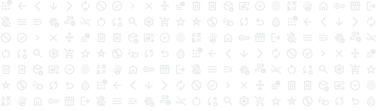

# Trivial-SVG: Pure-Lisp SVG renderer

This library allows you to render SVG images to PNG using [Vecto](https://www.xach.com/lisp/vecto/) and [zpb-ttf](https://github.com/xach/zpb-ttf).

The library is purely written in Common Lisp with no foreign dependency. It's optimized for fast parsing and rendering. 0BSD licensed.



> There're 168 Google Material Symbol SVGs in 32px above. The whole process of parsing + rendering + saving PNG cost 0.116 seconds in total. There's still many space for improvement. SBCL 2.5.0 on Apple M3 chip, renderer not cached.

## Package & Dependencies

We provide a single ASDF system `trivial-svg` defined in a single file [trivial-svg.lisp](./trivial-svg.lisp). It depends on:

- alexandria
- cl-ppcre
- plump
- serapeum
- vecto
- uiop

> 3/2/2025: Note that currently the Quicklisp distribution of `zpb-ttf` library (the necessary dependency of `vecto`) is staled. You should install the library manually with a version that at least later than [this commit](https://github.com/xach/zpb-ttf/commit/3b907c6f666cd3ed56ff2d469f23c5e26a709f2b). For example:
>
> ```bash
> git clone https://github.com/xach/zpb-ttf.git ~/quicklisp/local-projects/zpb-ttf/
> ```

## Usage

## Simple interface: `draw-svg-from-string`

``` common-lisp
(defparameter *test-svg-string*
  "<svg xmlns='http://www.w3.org/2000/svg'
        height='128px' viewBox='0 -960 960 960' width='128px' fill='#888888'>
     <path d='m321-80-71-71 329-329-329-329 71-71 400 400L321-80Z'/>
   </svg>")

(draw-svg-from-string *test-svg-string* "./test.png")
```

You are supposed to see a 128*128px gray right-chevron at `./test.png`.

*Function* **draw-svg-from-string** *svg-string output &key (font (get-font-file)) (viewport-width 1920) (viewport-height 1080)* => *NIL*

Draw the first SVG element inside *svg-string*. If *svg-string* is a pathname, read the content of the file. *output* can be either a stream, a pathname, or a namestring. 

The output PNG image will be resized to fit the size of SVG. *viewport-width* and *viewport-height* specify the initial width and height of the drawing area, which will only be used for resolving relative CSS length units in the outermost SVG element.

## Custom Drawing with Vecto

Trivial-SVG use the `graphics-state` of Vecto,  which means it can cooperate with any Vecto drawing actions.

> *Function* **create-renderer** *state* *node* *`&optional`* *(root-node node) (container-attributes (make-hash-table :test #'equalp))* => *function*
>
> The funcion `create-renderer` accepts a `plump:node` *node,* which should be a valid SVG element, and will parse it into a "renderer function". The `state` should be a `vecto::graphics-state` that is only used to query graphic information like geometry, font size and so on. `root-node` refers to the DOM root of the SVG element, it's used to search referenced elements by ID; `container-attributes` is used to store inherited attributes in recursive parsing.
>
> The result function accepts 1 argument: The `vecto::graphics-state` you want to draw the SVG with. Each time when the function is called, the function will execute a series of Vecto drawing functions to draw the SVG on the state at predefined location. You can use functions like `vecto::%translate` to change the drawing result.

Here's the code that's used to produce [example.png](./example.png), which can be an example for custom drawing implementation. The source code of `draw-svg-from-string` is also valuable for reference.

```common-lisp
(let* ((width (* 32 24))
       (height (* 32 7))
       (state (make-instance 'vecto::graphics-state
                             :width width
                             :height height
                             :transform-matrix (vecto::identity-matrix)))
       ;; We put 42 Google material symbols in ~/svg-test/
       (svg-files (directory "~/svg-test/*.svg")))
  (setf (vecto::image state)
        (make-instance 'zpng:png
                       :width width
                       :height height
                       :color-type vecto::+png-color-type+)
        (vecto::clipping-path state) (vecto::make-clipping-path width height))
  (vecto::%set-font state (vecto::%get-font state (trivial-svg:get-font-file)) 12)
  (loop for i from 0
        for svg-file in (serapeum:repeat-sequence svg-files 4)
        for svg-node = (first (plump:get-elements-by-tag-name (plump:parse svg-file) "svg"))
        do (multiple-value-bind (y x) (floor i 24)
             (let* ((state (vecto::copy state))
                    (renderer (trivial-svg:create-renderer state svg-node)))
               (vecto::%translate state (* x 32) (* y 32))
               (funcall renderer state))))
  (vecto::after-painting state)
  (zpng:write-png (vecto::image state)
                  (merge-pathnames "example.png" (asdf:system-source-directory :trivial-svg)))
  (vecto::clear-state state))
```

> Note: The exported interface of `Vecto` is too simple to handle complex drawing operations, you may need to refer the source code of `Vecto` to learn how to do. It's not difficult if you have the experience of any computer drawing system.

## Development

The plugin has not fully covered the SVG specification yet. It may misbehave when dealing with elements that are unsupported or complexly cascaded. Here's a list that it can deal with, emphasized means only partly implemented:

- Elements
  - circle
  - defs
  - ellipse
  - g
  - image
  - line
  - *linearGradient*
  - path
  - polygon
  - polyline
  - *radialGradient*
  - rect
  - stop
  - svg
  - *text*
  - *tspan*
  - use
- presentation attributes
  - color
  - fill
  - fill-opacity
  - fill-rule
  - opacity
  - stop-color
  - stop-opacity
  - stroke
  - stroke-dasharray
  - stroke-linecap
  - stroke-linejoin
  - stroke-opacity
  - stroke-width
  - transform

Here's what we're planning to do now:

- [x] [BUG] Fix the wrong interpretation of rotational transform matrix
- [x] Support specifying attributes with inline `style` attribute and CSS `style` element
- [ ] Support `text` and `tspan`
  - [x] `x`, `y`, `dx`, `dy`, `rotate`
  - [x] Get font with different weight/slant with `zpb-ttf` on all platforms
  - [ ] SVG2 Content area & SVG tiny `textArea`
  - [ ] ...

- [ ] Support `image`, `marker` and `symbol` (and maybe `a`?)
- [ ] Support gradients `spreadMethod` and `pattern`
- [ ] Support clipping and masking
- [ ] Formal error handling

### Testing

At the end of the [trivial-svg.lisp](./trivial-svg.lisp) there's an "interactive test", it will load a same SVG side-by-side, one using the `capi:browser-pane`, another using the `capi:output-pane` with `trivial-svg` library. It allows us to compare and check if the two images are identical on the screen. Images used for test are example images shown on W3C's SVG specification. You need LispWorks for Macintosh to run the interactive test, as `capi:browser-pane` does not support other Unix, and on Windows it is too old to use.

## Implementation Notes

This library is a port of [lw-svg](https://github.com/apr3vau/lw-plugins/tree/main/svg), with Vecto and zpb-ttf instead of LispWorks Graphics Port API, making it available for every implementation. The developer will maintain a synchronic update between the two library.

Since Vecto & cl-vector is not as powerful as LW-GP, the image quality produced by two libraries may slightly different.

To simplify porting, we wrote a partial implementation of LispWorks APIs, mainly Graphics Ports and Color packages, acting as a portable layer. These APIs are keeping consistent with LW data structure, and can be converted to conforms other libraries like `Vecto`. With this layer, we can constraint the difference between lw-svg and trivial-svg into a small area, which have simplified our works significantly.

There's also a partial CSS parser inside the code. Take them if they're useful for you.

---

## Acknowledgements

Thanks to Zachary P. Beane, and other contributors of `vecto`, `cl-vectors`, `zpb-ttf` and other libraries. Your endeavor for the infrastructure is the basis of this project.

Thanks my sister Simone, and my headmate May, who help and support me.

Supporting Neurodiversity & Transgender & Plurality!

🏳️‍🌈🏳️‍⚧️
